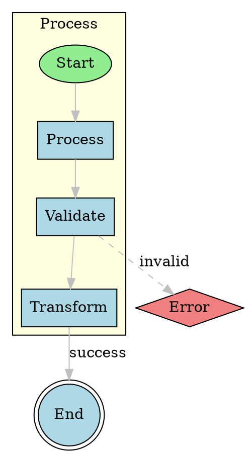

# graphviz-ts

A modern, zero-dependency TypeScript graph visualization library that runs in both browser and Node.js. A clean reimplementation of Graphviz concepts with no native dependencies, WASM, or containers required.

## Features

- **Zero dependencies** - Pure TypeScript, no external libraries
- **Runs anywhere** - Browser and Node.js compatible
- **DOT language support** - Parses standard Graphviz DOT format
- **Multiple layout engines**:
  - `dot` - Hierarchical layout for directed graphs (Sugiyama algorithm)
  - `neato` - Spring model / force-directed layout
  - `fdp` - Force-directed placement (Fruchterman-Reingold)
  - `circo` - Circular layout
  - `twopi` - Radial layout
- **SVG output** - Clean, scalable vector graphics
- **Simple API** - Easy to use with sensible defaults
- **TypeScript first** - Full type definitions included

## Installation

```bash
npm install graphviz-ts
```

Or use directly in the browser (see examples/web-demo.html).

## Quick Start

### Browser

```html
<script type="module">
  import { Graphviz } from 'graphviz-ts';

  const dot = `
    digraph G {
      A -> B -> C;
      B -> D;
    }
  `;

  const svg = Graphviz.dot(dot);
  document.body.innerHTML = svg;
</script>
```

### Node.js

```javascript
const { Graphviz } = require('graphviz-ts');

const dot = `
  digraph G {
    A -> B -> C;
    B -> D;
  }
`;

const svg = Graphviz.dot(dot);
console.log(svg);
```

### CLI

```bash
# Render a DOT file to SVG
graphviz-ts input.dot > output.svg

# Use force-directed layout
graphviz-ts -K neato input.dot -o output.svg

# Read from stdin
echo "digraph { A -> B }" | graphviz-ts
```

## API Reference

### Static Methods (Quick Usage)

```typescript
// Render with hierarchical layout (for directed graphs)
Graphviz.dot(dotString, options?): string

// Render with spring/force-directed layout
Graphviz.neato(dotString, options?): string

// Render with force-directed placement
Graphviz.fdp(dotString, options?): string

// Render with circular layout
Graphviz.circo(dotString, options?): string

// Render with radial layout
Graphviz.twopi(dotString, options?): string

// Auto-detect layout based on graph type
Graphviz.render(dotString, options?): string

// Parse DOT and return JSON
Graphviz.toJSON(dotString, options?): string
```

### Fluent API (More Control)

```typescript
const gv = new Graphviz(options);

// Parse DOT string
gv.parse(dotString);

// Apply layout
gv.layout(layoutOptions?);

// Render to format
const svg = gv.render(renderOptions?);

// Get the graph object for inspection
const graph = gv.getGraph();
```

### Low-Level Functions

```typescript
import { parse, layout, renderSVG, renderJSON } from 'graphviz-ts';

// Parse DOT string
const { graph, errors } = parse(dotString);

// Apply layout
const layoutGraph = layout(graph, { engine: 'dot' });

// Render
const svg = renderSVG(layoutGraph);
const json = renderJSON(layoutGraph, { pretty: true });
```

### Building Graphs Programmatically

```typescript
import { createGraph, addNode, addEdge, layout, renderSVG } from 'graphviz-ts';

const graph = createGraph('MyGraph', 'digraph');

addNode(graph, 'A', { shape: 'box', style: 'filled', fillcolor: 'lightblue' });
addNode(graph, 'B', { shape: 'ellipse' });
addNode(graph, 'C');

addEdge(graph, 'A', 'B', { label: 'connects' });
addEdge(graph, 'B', 'C');
addEdge(graph, 'A', 'C', { style: 'dashed' });

const layoutGraph = layout(graph, { engine: 'dot' });
const svg = renderSVG(layoutGraph);
```

## Options

### Layout Options

```typescript
interface LayoutOptions {
  engine?: 'dot' | 'neato' | 'fdp' | 'circo' | 'twopi';
  rankdir?: 'TB' | 'BT' | 'LR' | 'RL';  // For hierarchical layout
  ranksep?: number;  // Separation between ranks
  nodesep?: number;  // Separation between nodes
  iterations?: number;  // For force-directed layouts
  cooling?: number;  // Cooling rate for force-directed
}
```

### Render Options

```typescript
interface RenderOptions {
  format?: 'svg' | 'json';
  width?: number;
  height?: number;
  scale?: number;
  padding?: number;
  background?: string;
}
```

## DOT Language Support

### Supported Features

- Graph types: `graph`, `digraph`, `strict graph`, `strict digraph`
- Subgraphs and clusters
- Node attributes: `shape`, `label`, `style`, `color`, `fillcolor`, `fontname`, `fontsize`, `fontcolor`, `width`, `height`, `penwidth`
- Edge attributes: `label`, `style`, `color`, `fontcolor`, `arrowhead`, `arrowtail`, `dir`, `penwidth`, `weight`, `minlen`
- Graph attributes: `rankdir`, `ranksep`, `nodesep`, `label`, `bgcolor`, `fontname`, `fontsize`
- Comments: `//`, `#`, `/* */`
- Quoted strings and HTML labels
- Default attributes: `node [...]`, `edge [...]`

### Supported Shapes

`box`, `rect`, `rectangle`, `square`, `ellipse`, `oval`, `circle`, `doublecircle`, `point`, `plaintext`, `plain`, `none`, `diamond`, `triangle`, `invtriangle`, `house`, `invhouse`, `trapezium`, `invtrapezium`, `parallelogram`, `pentagon`, `hexagon`, `septagon`, `octagon`, `doubleoctagon`, `star`, `cylinder`, `note`, `folder`, `component`, `Mdiamond`, `Msquare`, `Mcircle`

### Example DOT



## Layout Engines

### dot (Hierarchical)

Best for directed acyclic graphs (DAGs), flowcharts, and hierarchies. Uses the Sugiyama algorithm:

1. **Rank assignment** - Assigns nodes to horizontal layers
2. **Ordering** - Minimizes edge crossings within ranks
3. **Position assignment** - Assigns x-coordinates
4. **Edge routing** - Creates smooth spline paths

```javascript
const svg = Graphviz.dot(dotString, { rankdir: 'LR' });
```

### neato / fdp (Force-Directed)

Best for undirected graphs and when you want nodes to spread naturally. Uses the Fruchterman-Reingold algorithm:

- Repulsive forces between all nodes
- Attractive forces along edges
- Iterative simulation with cooling

```javascript
const svg = Graphviz.neato(dotString, { iterations: 500 });
```

### circo (Circular)

Places nodes in a circle. Good for ring topologies and small graphs.

```javascript
const svg = Graphviz.circo(dotString);
```

### twopi (Radial)

Places nodes in concentric circles based on graph distance from a root. Good for tree-like structures.

```javascript
const svg = Graphviz.twopi(dotString);
```

## CLI Reference

```
graphviz-ts - Graph visualization in TypeScript

Usage:
  graphviz-ts [options] <input.dot>
  cat graph.dot | graphviz-ts [options]

Options:
  -K, --layout <engine>   Layout engine: dot, neato, fdp, circo, twopi
  -T, --format <format>   Output format: svg, json (default: svg)
  -o, --output <file>     Output file (default: stdout)
  -s, --scale <number>    Scale factor (default: 1)
  -h, --help              Show help
  -v, --version           Show version

Examples:
  graphviz-ts input.dot > output.svg
  graphviz-ts -K neato -o output.svg input.dot
  echo "digraph { A -> B }" | graphviz-ts
```

## Browser Usage

For standalone browser usage without a build step, see `examples/web-demo.html`. It includes a self-contained version of the library.

For modern ES modules:

```html
<script type="module">
  import { Graphviz } from './dist/index.mjs';
  // ...
</script>
```

## TypeScript

Full TypeScript definitions are included:

```typescript
import {
  Graph,
  Node,
  Edge,
  Graphviz,
  LayoutEngine,
  OutputFormat,
  NodeShape,
  ArrowType,
  // ... and more
} from 'graphviz-ts';
```

## Comparison with Original Graphviz

| Feature | graphviz-ts | Original Graphviz |
|---------|-------------|-------------------|
| Language | TypeScript | C |
| Dependencies | None | Many native libs |
| Browser Support | Native | Via WASM (large) |
| Installation | npm install | Complex |
| DOT Support | Subset | Full |
| Output Formats | SVG, JSON | Many (PNG, PDF, etc.) |
| Layout Quality | Good | Excellent |
| Performance | Fast | Faster for large graphs |

## Development

```bash
# Install dependencies
npm install

# Build
npm run build

# Run CLI in development
npm run cli -- input.dot

# Watch mode
npm run dev
```

## License

MIT

## Contributing

Contributions are welcome! Please feel free to submit issues and pull requests.

## Acknowledgments

Inspired by the original [Graphviz](https://graphviz.org/) project and its excellent graph layout algorithms.
