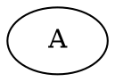

# Batch Fix Request for graphviz-ts

## Summary
Total failing tests: 1
Total issues to fix: 2

## Issues by File

### src/parser/parser.ts

#### issue-1: Node count mismatch: expected 2, got 9
- **Severity**: major
- **Category**: incorrect-output
- **Test**: single-node
- **Details**: The parser or renderer is creating extra nodes
- **Suggested Fix**: Check for duplicate node creation in parser

### src/layout/hierarchical.ts

#### issue-2: Nodes are overlapping in output
- **Severity**: minor
- **Category**: layout-error
- **Test**: single-node
- **Details**: Overlap score: 66.7%
- **Suggested Fix**: Increase node separation or adjust spacing parameters

## Failing Test Cases

### single-node

Score: 46.2%

## Instructions
1. Fix the issues in order of severity (critical first)
2. After each fix, the affected tests should show improvement
3. Run the evaluator after fixes to verify: `npm run eval`
4. Target: All tests should pass with score >= 60%
