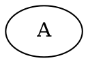

# graphviz-ts Evaluation Results

## Summary
- **Total Tests**: 21
- **Passed**: 20 (95.2%)
- **Failed**: 1
- **Average Score**: 76.8%

## Top Issues to Fix

### 1. Node count mismatch: expected 2, got 9
- **Severity**: major
- **Category**: incorrect-output
- **Test**: single-node
- **File**: src/parser/parser.ts
- **Fix**: Check for duplicate node creation in parser



## Instructions for Fixing

1. Start with critical issues first
2. For each issue:
   - Read the affected source file
   - Understand the expected behavior from real Graphviz
   - Implement a fix
   - Run `npm run eval` to verify

3. Common fix patterns:
   - **Parsing errors**: Check `src/parser/parser.ts` and `src/parser/lexer.ts`
   - **Layout errors**: Check `src/layout/hierarchical.ts` or `src/layout/force-directed.ts`
   - **Rendering errors**: Check `src/render/svg.ts`
   - **Missing features**: Add support in the appropriate module

4. After all fixes, run full evaluation:
   ```bash
   cd /home/user/graphviz/graphviz-ts
   npm run eval
   ```
