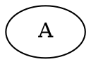

# Fix Request for graphviz-ts

## Issue
**ID**: issue-1
**Severity**: major
**Category**: incorrect-output
**Description**: Node count mismatch: expected 2, got 9

## Details
The parser or renderer is creating extra nodes

## Test Case
**Name**: single-node
**Category**: simple-graphs
**Layout Engine**: dot
**Difficulty**: basic

### DOT Input

## Comparison Metrics
- Structural Similarity: -75.0%
- Layout Similarity: 100.0%
- Node Overlap Score: 66.7%
- Overall Score: 46.2%

## Expected vs Actual
- Expected nodes: 2
- Actual nodes: 9
- Expected edges: 0
- Actual edges: 0

## Affected File
`src/parser/parser.ts`

## Suggested Fix Approach
Check for duplicate node creation in parser

## Instructions
1. Analyze the issue and understand why graphviz-ts is producing different output than real Graphviz
2. Locate the relevant code in the graphviz-ts source (in /home/user/graphviz/graphviz-ts/src)
3. Implement a fix that addresses the issue
4. The fix should make graphviz-ts produce output more similar to real Graphviz for this test case
5. After fixing, the test should pass with an overall score >= 60%

## Important
- Do not break existing functionality
- Keep changes minimal and focused
- Add comments explaining the fix if the logic is complex
